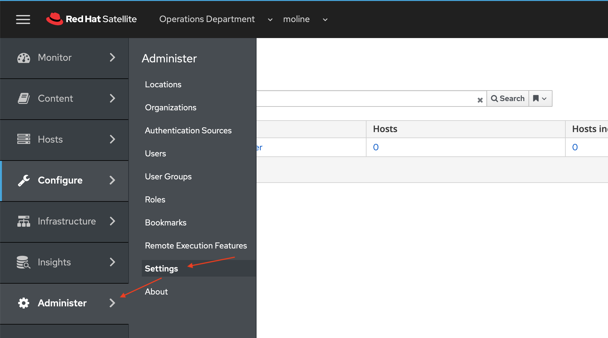

# Part 6: Integrating the VMWare Resources with Satellite

[Tutorial Menu](https://github.com/pslucas0212/RedHat-Satellite-VM-Provisioning-to-vSphere-Tutorial)  

### Integrating the VMWare Resources with Satellite. 

We are going to pre-define hardware settings for a virtual machine in Satellite by creating a compute profile.  On the Satellite Console chose Infrastructure -> Compute Profiles.

On the Compute Profiles page, click the blue Create Compute Profile button.  

On the Compute Profiles > Create Compute Profile, enter cp-vmware-small for the Name and click the blue Submit button.  

  

On the Compute Profiles > cp-vmware-small page click the cr-vcenter link to define the new compute profile cp-vmware-small.  

We will now define the configuration of the RHEL VM that will be provisioned to VMWare from Satellite.  We will mostly accept default values.  Configuration changes are listed in the following table.  

Name | Value
---- | -----
Cluster | LabCluster
Guest OS | Red Hat Enterprise Linux 8 (64 bit)
Virtual H/W version | 14 (EXSi 6.7)
Image | img-rhel8-prem-server
Create SCSI controller | VMware Paravirtual
Datastore | LabDatastore
Size(GB) | 20 GB
Thin Provision | Uncheck
NIC type | VNXNET3
Network | VM Network

The next two screen shots show what your configuration should look like.  Click the blue Submit button when you have finished with the configuration.  You will be returned to the  Compute Profiles > cp-vmware-small page.  

We will now define a host group within Satellite as a way to bring all these part together to provision a RHEL 8.3 VM on VMWare.

On the side menu choose Configure -> Host Groups.  

On the Host Groups page make sure that you have Operations Department and moline selected for Organization and Location.  Click the blue Create Host Group button.

On the Host Groups > Create Host Group page, we will start filling in or selecting the options on the Host Group Tab

Host Group Tab:
Name | Value
---- | -----
Name | hg-rhel8-prem-server
Lifecycle Environment | le-ops-rhel8-prem-server
Content View | cv-rhel8-prem-server
Content Source | sat01.example.com
Deploy On | cr-vcenter
Compute Profile | cp-vmware-small

  

Now click on the Network tab.  Fill in or selection the follow optons.  

Network Tab:
Name | Value
---- | -----
Domain | example.com
IPv4 Subnet | cn-operations-department

  

Now click on the Operating System tab.  Fill in or selection the follow optons. 

Operating System Tab:
Name | Value
---- | -----
Architecture | x86_64
Operating System | RedHt 8.3

  

Check the Locations and Organizations tab to make sure that moline is set for Locations and Operations Department is set for Organizations.

Now click on the Activation Key tab.  Fill in ak-ops-rhel8--prem-server in the Activation Keys text field.   Click the blue Submit button.

One last option to configure and we are ready to test our deployment.  When I de-provision a VM running on vSphere from Satellite, I want the VM deleted.  To enable this capability Administer -> Settings from the side menu.

On the Settings page in the Filter/Search text field, enter "Destroy associated VM on host delete" and click the Search button.  The result will show the Destroy associated VM on host delete option.  Click on the pencil (edit) icon. 

  

A dialog box will pop up with the title Update value for Destroy associated VM on host delete setting.  Click the drop down and choose Yes, and click the blue Submit button to accept the changed value.  The setting is now updated.

## References  
[Installing Satellite Server from a Connected Network](https://access.redhat.com/documentation/en-us/red_hat_satellite/6.9/html/installing_satellite_server_from_a_connected_network/index)   
[Simple Content Access](https://access.redhat.com/articles/simple-content-access)  
[Provisioning VMWare using userdata via Satellite 6.3-6.6](https://access.redhat.com/blogs/1169563/posts/3640721)  
[Understanding Red Hat Content Delivery Network Repositories and their usage with Satellite 6](https://access.redhat.com/articles/1586183)
